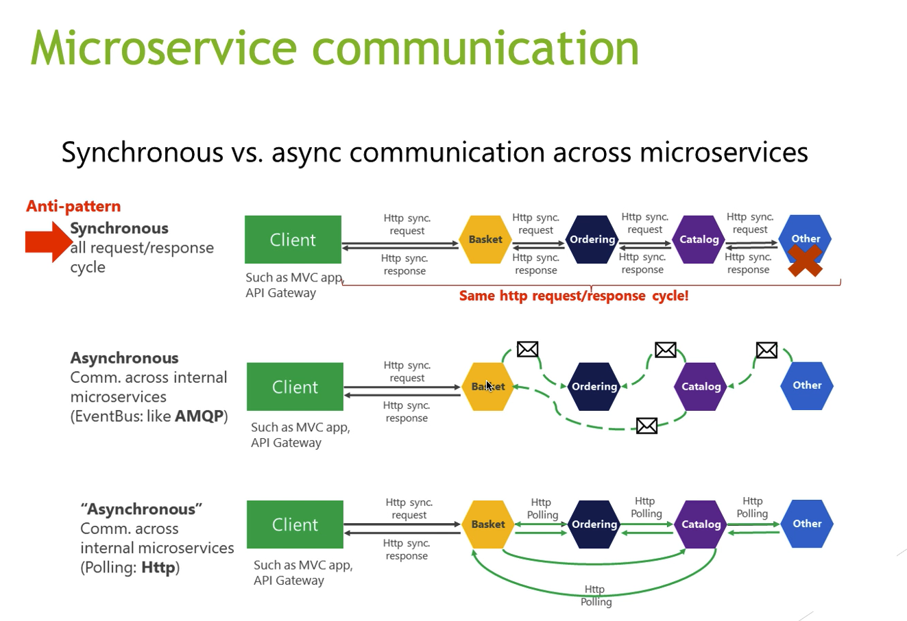

# Microservices communication

### 1. **Synchronous protocol**
- HTTP/HTTPS.
- The client sends a request to server and waits for a response from service.
- Threads is block.
- The client code can only continue when receives the HTTP response from the server.

### 2. **Asynchronous protocol**    
- AMQP (Advanced Message Queuing Protocol): a protocol supported by many OS and cloud enviroments.
- Asynchronous messages.
- The client send request and don't wait for the response.
- Use RabbitMQ or Kafka, etc. Is a message queue.
