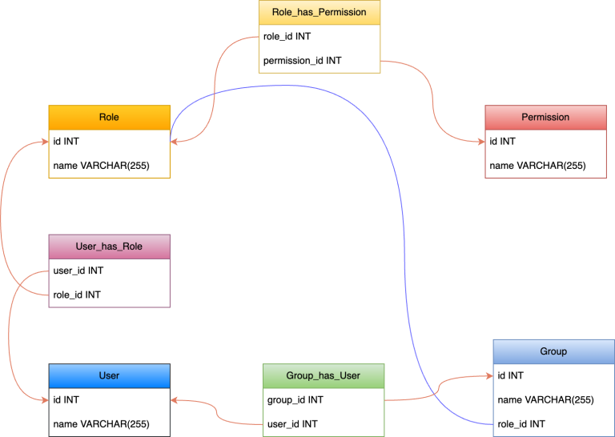

# **Role-Based Access Control (RBAC)**

## RBAC là gì?

- RBAC(Role-Based Access Control) là mô hình quản lý quyền truy cập dựa trên vai trò.
- Nguyên tắc cơ bản của RBAC là người dùng được gán vào các nhóm, và các nhóm này được gán các quyền truy cập vào các tài nguyên.

## Tại sao RBAC lại quan trọng?

- Quản lý quyền rõ ràng và dễ dàng.
- Nâng cao bảo mật bằng cách hạn chế quyền truy cập dựa trên vai trò.
- Giảm thiểu rủi ro liên quan đến việc cấp quyền trực tiếp cho người dùng.
- Dễ dàng mở rộng hệ thống.

## Khi nào nên sử dụng RBAC?

- Khi hệ thống có nhiều người dùng và nhiều nhóm người dùng với quyền hạn khác nhau.
- Khi cần quản lý quyền truy cập một cách rõ ràng chặt chẽ.

## Các thành phần của RBAC

- **User**: Người dùng.
- **Role**: Vai trò.
- **Permission**: Quyền truy cập.
- **Group**: Nhóm người dùng.
- **UserHasRole**: Mối quan hệ giữa người dùng và vai trò.
- **RoleHasPermission**: Mối quan hệ giữa vai trò và quyền truy cập.
- **GroupHasUser**: Mối quan hệ giữa nhóm người dùng và người dùng.

